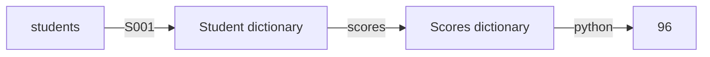
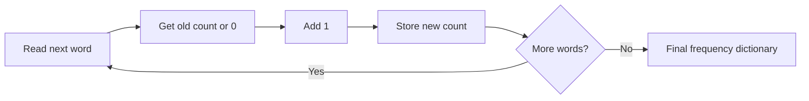
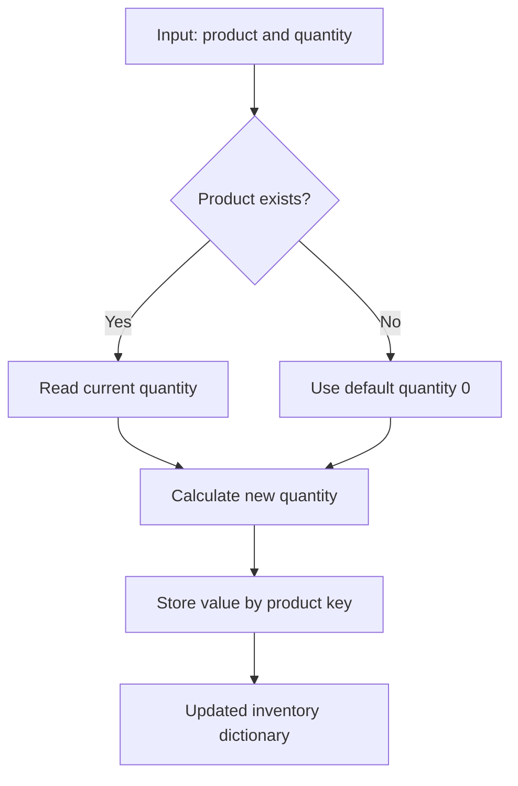

# Python Dictionaries: Complete Guide

## 1. What Is a Dictionary?

A **dictionary** is a mutable collection that stores data as **key-value pairs**.
Instead of using a numeric position like a list, a dictionary uses a key to find
its related value.

```python
student = {
    "name": "Amina",
    "age": 21,
    "course": "Python",
}
```

In this dictionary:

| Key | Value |
| --- | --- |
| `"name"` | `"Amina"` |
| `"age"` | `21` |
| `"course"` | `"Python"` |

Think of a dictionary like a real dictionary:

```text
word (key)  ------> definition (value)
"name"      ------> "Amina"
"age"       ------> 21
"course"    ------> "Python"
```

### Main characteristics

- **Key-value based:** each key points to one value.
- **Mutable:** items can be added, changed, and removed.
- **Unique keys:** one dictionary cannot contain duplicate keys.
- **Insertion ordered:** Python preserves item insertion order (guaranteed in
  Python 3.7 and later).
- **Fast lookup:** finding a value by key is usually `O(1)` average time.
- **Dynamic:** a dictionary can grow or shrink while the program runs.
- **Heterogeneous:** values can have different data types.

> A dictionary is sometimes called a **mapping**, **map**, **associative
> array**, or **hash map** in other programming languages.

---

## 2. Dictionary Structure

The general syntax is:

```python
dictionary_name = {
    key1: value1,
    key2: value2,
    key3: value3,
}
```

The colon `:` separates a key from its value. A comma `,` separates one pair
from another.

```text
{
    "name": "Amina",
       |        |
      key     value
}
```

### Valid key types

Dictionary keys must be **hashable**, which generally means they must not
change during their lifetime.

Common valid key types:

```python
data = {
    "name": "Amina",           # string key
    1: "first",                # integer key
    3.14: "pi",                # float key
    True: "enabled",           # Boolean key
    (10, 20): "coordinates",   # tuple containing hashable values
}
```

Common invalid key types:

```python
# These raise TypeError: unhashable type
invalid = {
    [1, 2]: "list",       # lists are mutable
    {1, 2}: "set",        # sets are mutable
    {"a": 1}: "dict",    # dictionaries are mutable
}
```

Values do not need to be hashable. A value can be almost any Python object:

```python
profile = {
    "name": "Amina",
    "scores": [87, 92, 95],
    "address": {"city": "Addis Ababa", "country": "Ethiopia"},
    "active": True,
    "middle_name": None,
}
```

### Keys are unique

If the same key appears more than once, the last value replaces the earlier
value:

```python
user = {
    "name": "Abel",
    "name": "Amina",
}

print(user)  # {'name': 'Amina'}
```

> `True` and `1` compare as equal and have the same hash. Similarly, `False`
> and `0` act as the same dictionary key.

---

## 3. Creating Dictionaries

### Dictionary literal

```python
empty = {}

person = {
    "name": "Amina",
    "age": 21,
}
```

### The `dict()` constructor

Keyword arguments can be used when all keys are valid Python names:

```python
person = dict(name="Amina", age=21, active=True)
print(person)
# {'name': 'Amina', 'age': 21, 'active': True}
```

Create a dictionary from pairs:

```python
pairs = [("name", "Amina"), ("age", 21)]
person = dict(pairs)
```

Create a dictionary by joining two sequences with `zip()`:

```python
keys = ["name", "age", "course"]
values = ["Amina", 21, "Python"]

student = dict(zip(keys, values))
print(student)
# {'name': 'Amina', 'age': 21, 'course': 'Python'}
```

### `dict.fromkeys()`

Use `fromkeys()` to give several keys the same initial value:

```python
permissions = dict.fromkeys(["read", "write", "delete"], False)
print(permissions)
# {'read': False, 'write': False, 'delete': False}
```

Be careful with mutable default values. Every key refers to the **same** list
in this example:

```python
groups = dict.fromkeys(["A", "B"], [])
groups["A"].append("Amina")

print(groups)
# {'A': ['Amina'], 'B': ['Amina']}
```

Use a comprehension when each key needs its own list:

```python
groups = {key: [] for key in ["A", "B"]}
groups["A"].append("Amina")

print(groups)
# {'A': ['Amina'], 'B': []}
```

---

## 4. How a Dictionary Works Internally

Python dictionaries are implemented using a **hash table**. The exact internal
layout is an implementation detail, but this mental model explains dictionary
behavior.

### Lookup data flow

```mermaid
flowchart LR
    A[Key: "name"] --> B[Calculate hash]
    B --> C[Find table position]
    C --> D{Matching key?}
    D -- Yes --> E[Return value: "Amina"]
    D -- No --> F[Check collision location]
    F --> D
    D -- Missing --> G[Raise KeyError or use default]
```

The same process as plain text:

```text
dictionary["name"]
        |
        v
hash("name") creates an integer
        |
        v
the hash identifies a likely table position
        |
        v
Python compares the stored key with "name"
        |
        +---- match ----> return "Amina"
        |
        +---- no match -> continue collision search or report missing key
```

### Step-by-step lookup

For this expression:

```python
student["name"]
```

Python conceptually does the following:

1. Calls the key's hash operation, similar to `hash("name")`.
2. Uses that hash to find a likely location in the hash table.
3. Checks whether the key stored there equals `"name"`.
4. Returns the related value if the key matches.
5. Searches another location if a **hash collision** occurred.
6. Raises `KeyError` if the key cannot be found.

### What is a hash?

A hash is an integer calculated from a hashable object:

```python
print(hash("name"))
print(hash((10, 20)))
```

The exact number can differ between Python processes, so do not store it or
depend on its value.

### What is a hash collision?

A collision happens when different keys lead to the same table position.
Python handles collisions internally by checking both the hash and key
equality, then searching other positions when necessary.

```text
hash(key A) ----\
                 >---- same table area ----> Python compares the actual keys
hash(key B) ----/
```

Collisions do not mean one item overwrites another unless the keys are equal.

### Why keys must be hashable

If a key changed after insertion, its hash or equality could change. Python
might then search in the wrong location and lose access to the value. Immutable
types avoid this problem.

### Time complexity

Let `n` be the number of dictionary items.

| Operation | Average time | Worst case |
| --- | ---: | ---: |
| Get by key | `O(1)` | `O(n)` |
| Insert or update | `O(1)` | `O(n)` |
| Delete by key | `O(1)` | `O(n)` |
| `key in dictionary` | `O(1)` | `O(n)` |
| Iterate all items | `O(n)` | `O(n)` |
| Copy a dictionary | `O(n)` | `O(n)` |

`O(1)` means the average lookup time does not grow linearly with the number of
items. The rare worst cases can involve many collisions or table resizing.

---

## 5. Reading Values

### Square-bracket access

Use `dictionary[key]` when the key must exist:

```python
student = {"name": "Amina", "age": 21}

print(student["name"])  # Amina
print(student["age"])   # 21
```

A missing key raises `KeyError`:

```python
print(student["email"])
# KeyError: 'email'
```

### Safe access with `get()`

`get()` returns `None` when the key does not exist:

```python
email = student.get("email")
print(email)  # None
```

You can provide a custom default value:

```python
email = student.get("email", "Not provided")
print(email)  # Not provided
```

Choose the access style based on your program's rules:

```python
# Use [] when a missing key means the data is invalid.
required_name = student["name"]

# Use get() when the key is optional.
optional_email = student.get("email", "Not provided")
```

### Check before access

```python
if "email" in student:
    print(student["email"])
else:
    print("Email is missing")
```

Membership checks dictionary **keys**, not values:

```python
student = {"name": "Amina", "age": 21}

print("name" in student)           # True
print("Amina" in student)          # False
print("Amina" in student.values()) # True
```

---

## 6. Adding and Updating Items

### Add one item

Assigning to a new key adds a pair:

```python
student = {"name": "Amina"}
student["age"] = 21

print(student)
# {'name': 'Amina', 'age': 21}
```

### Update one item

Assigning to an existing key replaces its value:

```python
student["age"] = 22
```

### Update several items

```python
student.update({
    "age": 22,
    "course": "Advanced Python",
})
```

`update()` can also accept keyword arguments:

```python
student.update(active=True, city="Addis Ababa")
```

### Insert only when missing with `setdefault()`

```python
student = {"name": "Amina"}

course = student.setdefault("course", "Python")
print(course)   # Python
print(student)  # {'name': 'Amina', 'course': 'Python'}
```

If the key already exists, `setdefault()` keeps the old value:

```python
student.setdefault("name", "Unknown")
print(student["name"])  # Amina
```

### Merge dictionaries

Python 3.9 and later support the merge operator `|`:

```python
defaults = {"theme": "light", "language": "en"}
user_settings = {"theme": "dark", "font_size": 16}

settings = defaults | user_settings
print(settings)
# {'theme': 'dark', 'language': 'en', 'font_size': 16}
```

When keys overlap, the dictionary on the **right** wins.

`|=` updates the original dictionary:

```python
defaults |= user_settings
```

Dictionary unpacking works in Python 3.5 and later:

```python
settings = {**defaults, **user_settings}
```

---

## 7. Removing Items

### `pop()` - remove a key and return its value

```python
student = {"name": "Amina", "age": 21}

removed_age = student.pop("age")
print(removed_age)  # 21
print(student)      # {'name': 'Amina'}
```

A default prevents `KeyError`:

```python
removed_email = student.pop("email", None)
```

### `popitem()` - remove and return the newest pair

```python
student = {"name": "Amina", "age": 21}

pair = student.popitem()
print(pair)     # ('age', 21)
print(student)  # {'name': 'Amina'}
```

Since Python 3.7, `popitem()` uses LIFO order: **last in, first out**. It raises
`KeyError` when the dictionary is empty.

### `del` - delete by key

```python
del student["name"]
```

`del` raises `KeyError` if the key is missing.

### `clear()` - remove every item

```python
student.clear()
print(student)  # {}
```

### Delete the variable itself

```python
del student
# The variable student no longer exists.
```

---

## 8. Dictionary Views

The methods `keys()`, `values()`, and `items()` return **view objects**. A view
is connected to the dictionary and reflects later changes.

```python
student = {"name": "Amina", "age": 21}
keys_view = student.keys()

student["course"] = "Python"
print(keys_view)
# dict_keys(['name', 'age', 'course'])
```

### `keys()`

```python
print(student.keys())
# dict_keys(['name', 'age', 'course'])
```

### `values()`

```python
print(student.values())
# dict_values(['Amina', 21, 'Python'])
```

### `items()`

Each item is returned as a `(key, value)` tuple:

```python
print(student.items())
# dict_items([('name', 'Amina'), ('age', 21), ('course', 'Python')])
```

Convert a view when a separate list is needed:

```python
keys_list = list(student.keys())
values_list = list(student.values())
pairs_list = list(student.items())
```

---

## 9. Looping Through a Dictionary

### Loop through keys

Looping directly over a dictionary produces its keys:

```python
student = {"name": "Amina", "age": 21, "course": "Python"}

for key in student:
    print(key)
```

This is equivalent to:

```python
for key in student.keys():
    print(key)
```

### Loop through values

```python
for value in student.values():
    print(value)
```

### Loop through keys and values

```python
for key, value in student.items():
    print(f"{key}: {value}")
```

Data flow for the loop:

```text
student.items()
      |
      v
("name", "Amina")  --> key = "name",   value = "Amina"
("age", 21)         --> key = "age",    value = 21
("course", "Python") --> key = "course", value = "Python"
```

### Loop in sorted key order

```python
for key in sorted(student):
    print(key, student[key])
```

### Loop with a position number

```python
for position, (key, value) in enumerate(student.items(), start=1):
    print(position, key, value)
```

### Do not change dictionary size during iteration

This raises `RuntimeError`:

```python
scores = {"Amina": 92, "Abel": 48, "Sara": 75}

# Do not do this.
for name, score in scores.items():
    if score < 50:
        del scores[name]
```

Iterate over a copy when adding or removing keys:

```python
for name, score in list(scores.items()):
    if score < 50:
        del scores[name]
```

Updating the value of an existing key does not change dictionary size:

```python
for name in scores:
    scores[name] += 5
```

---

## 10. Dictionary Methods Reference

| Method | Purpose | Returns |
| --- | --- | --- |
| `d.clear()` | Removes all items | `None` |
| `d.copy()` | Makes a shallow copy | New dictionary |
| `dict.fromkeys(keys, value)` | Creates keys with one default value | New dictionary |
| `d.get(key, default)` | Safely reads a value | Value or default |
| `d.items()` | Gets key-value pairs | Dynamic items view |
| `d.keys()` | Gets all keys | Dynamic keys view |
| `d.pop(key, default)` | Removes a key | Removed value or default |
| `d.popitem()` | Removes newest pair | `(key, value)` tuple |
| `d.setdefault(key, default)` | Gets value or inserts default | Existing or new value |
| `d.update(other)` | Adds or replaces several items | `None` |
| `d.values()` | Gets all values | Dynamic values view |

Example using several methods:

```python
inventory = {"laptop": 4, "mouse": 10}

inventory.update({"keyboard": 6})
inventory.setdefault("monitor", 0)
mouse_count = inventory.get("mouse", 0)
removed_count = inventory.pop("laptop")

print(inventory.items())
print(mouse_count)
print(removed_count)
```

---

## 11. Built-in Functions Used With Dictionaries

Dictionary **methods** belong to dictionary objects, such as `d.get()`.
Built-in **functions** are called separately, such as `len(d)`.

| Function | Example | Result or purpose |
| --- | --- | --- |
| `len(d)` | `len(student)` | Number of key-value pairs |
| `type(d)` | `type(student)` | `<class 'dict'>` |
| `dict(data)` | `dict(pairs)` | Creates a dictionary |
| `list(d)` | `list(student)` | List of keys |
| `tuple(d)` | `tuple(student)` | Tuple of keys |
| `set(d)` | `set(student)` | Set of keys |
| `sorted(d)` | `sorted(student)` | Sorted list of keys |
| `min(d)` | `min(numbers)` | Smallest key |
| `max(d)` | `max(numbers)` | Largest key |
| `any(d)` | `any(flags)` | Whether any key is truthy |
| `all(d)` | `all(flags)` | Whether every key is truthy |
| `sum(d.values())` | `sum(scores.values())` | Sum of numeric values |

Examples:

```python
scores = {"Amina": 92, "Abel": 81, "Sara": 88}

print(len(scores))             # 3
print(sorted(scores))          # ['Abel', 'Amina', 'Sara']
print(sum(scores.values()))    # 261
print(max(scores.values()))    # 92
```

Find the key with the largest value:

```python
top_student = max(scores, key=scores.get)
print(top_student)  # Amina
```

Sort items by value:

```python
ranking = sorted(scores.items(), key=lambda item: item[1], reverse=True)
print(ranking)
# [('Amina', 92), ('Sara', 88), ('Abel', 81)]
```

---

## 12. Dictionary Comprehensions

A dictionary comprehension creates a dictionary from an iterable.

### Basic syntax

```python
new_dictionary = {key_expression: value_expression for item in iterable}
```

### Create squares

```python
squares = {number: number ** 2 for number in range(1, 6)}
print(squares)
# {1: 1, 2: 4, 3: 9, 4: 16, 5: 25}
```

### Filter items

```python
scores = {"Amina": 92, "Abel": 48, "Sara": 75}

passing = {
    name: score
    for name, score in scores.items()
    if score >= 50
}

print(passing)
# {'Amina': 92, 'Sara': 75}
```

### Transform keys and values

```python
prices = {"LAPTOP": 1200, "MOUSE": 25}

normalized = {
    product.lower(): price * 1.15
    for product, price in prices.items()
}
```

### Reverse keys and values

```python
countries = {"ET": "Ethiopia", "KE": "Kenya"}
codes = {country: code for code, country in countries.items()}
```

Only reverse a dictionary when the original values are hashable and unique.
Duplicate values would become duplicate keys and some data would be lost.

---

## 13. Nested Dictionaries

A dictionary can contain other dictionaries.

```python
students = {
    "S001": {
        "name": "Amina",
        "scores": {"math": 92, "python": 96},
    },
    "S002": {
        "name": "Abel",
        "scores": {"math": 84, "python": 88},
    },
}
```

Nested access moves one level at a time:



```python
python_score = students["S001"]["scores"]["python"]
print(python_score)  # 96
```

Update nested data:

```python
students["S001"]["scores"]["python"] = 98
```

Loop through nested data:

```python
for student_id, details in students.items():
    name = details["name"]
    python_score = details["scores"]["python"]
    print(f"{student_id}: {name} scored {python_score}")
```

Safe nested access with `get()`:

```python
python_score = (
    students.get("S003", {})
    .get("scores", {})
    .get("python")
)
```

For complex required data, validate the structure instead of silently chaining
defaults. Chained `get()` calls can hide malformed input.

---

## 14. Dictionaries and Functions

### Pass a dictionary to a function

```python
def print_profile(profile):
    for key, value in profile.items():
        print(f"{key}: {value}")


user = {"name": "Amina", "age": 21}
print_profile(user)
```

### Read values in a function

```python
def calculate_average(scores):
    if not scores:
        return 0
    return sum(scores.values()) / len(scores)


result = calculate_average({"math": 90, "python": 96})
print(result)  # 93.0
```

### Return a dictionary from a function

```python
def create_user(name, age):
    return {
        "name": name,
        "age": age,
        "active": True,
    }


user = create_user("Amina", 21)
```

### Mutation inside a function

Dictionaries are mutable. A function can change the original dictionary that
was passed to it:

```python
def activate(user):
    user["active"] = True


account = {"name": "Amina", "active": False}
activate(account)
print(account["active"])  # True
```

Data flow:

```text
account variable ----\
                     >---- same dictionary object ----> value is changed
user parameter ------/
```

Copy first when the function should return changed data without modifying the
caller's dictionary:

```python
def with_active_status(user):
    updated_user = user.copy()
    updated_user["active"] = True
    return updated_user
```

### Accept arbitrary keyword arguments with `**kwargs`

Inside the function, `kwargs` is a dictionary:

```python
def create_profile(**kwargs):
    print(type(kwargs))  # <class 'dict'>
    return kwargs


profile = create_profile(name="Amina", age=21, city="Addis Ababa")
```

### Unpack a dictionary into function arguments

```python
def introduce(name, age):
    return f"My name is {name} and I am {age}."


person = {"name": "Amina", "age": 21}
message = introduce(**person)
```

The dictionary keys must match the function's parameter names.

### Type hints

```python
def total_inventory(inventory: dict[str, int]) -> int:
    return sum(inventory.values())
```

For fixed fields with specific types, `TypedDict` provides stronger static
checking:

```python
from typing import TypedDict


class User(TypedDict):
    name: str
    age: int
    active: bool


def describe_user(user: User) -> str:
    return f"{user['name']} is {user['age']} years old."
```

---

## 15. Copying Dictionaries

### Assignment does not copy

Both variables refer to the same object:

```python
original = {"name": "Amina"}
alias = original

alias["name"] = "Abel"
print(original["name"])  # Abel
```

```text
original ----\
              >---- {'name': 'Amina'}
alias --------/
```

### Shallow copy

```python
original = {"name": "Amina", "scores": [90, 95]}
copied = original.copy()
```

The outer dictionaries are separate, but nested mutable objects are shared:

```python
copied["name"] = "Abel"
print(original["name"])  # Amina

copied["scores"].append(100)
print(original["scores"])  # [90, 95, 100]
```

Another shallow-copy form is:

```python
copied = dict(original)
```

### Deep copy

Use `copy.deepcopy()` when nested mutable objects must also be independent:

```python
from copy import deepcopy

original = {"name": "Amina", "scores": [90, 95]}
copied = deepcopy(original)

copied["scores"].append(100)
print(original["scores"])  # [90, 95]
```

---

## 16. Practical Data-Flow Patterns

### Pattern 1: Frequency counter

Count how many times each word appears:

```python
words = ["python", "dict", "python", "loop", "dict", "python"]
counts = {}

for word in words:
    counts[word] = counts.get(word, 0) + 1

print(counts)
# {'python': 3, 'dict': 2, 'loop': 1}
```



For production code, `collections.Counter` expresses this pattern directly:

```python
from collections import Counter

counts = Counter(words)
```

### Pattern 2: Group records

```python
students = [
    {"name": "Amina", "course": "Python"},
    {"name": "Abel", "course": "Web"},
    {"name": "Sara", "course": "Python"},
]

by_course = {}

for student in students:
    course = student["course"]
    by_course.setdefault(course, []).append(student["name"])

print(by_course)
# {'Python': ['Amina', 'Sara'], 'Web': ['Abel']}
```

`defaultdict` is useful for repeated grouping:

```python
from collections import defaultdict

by_course = defaultdict(list)

for student in students:
    by_course[student["course"]].append(student["name"])
```

### Pattern 3: Fast lookup table

Convert a list of records into a dictionary indexed by ID:

```python
users = [
    {"id": 101, "name": "Amina"},
    {"id": 102, "name": "Abel"},
]

users_by_id = {user["id"]: user for user in users}

print(users_by_id[102]["name"])  # Abel
```

Data flow:

```text
list search:       records -> check -> check -> check -> result   O(n)
dictionary lookup: user ID -> hash -> matching record             O(1) average
```

### Pattern 4: Configuration with defaults

```python
default_config = {
    "theme": "light",
    "language": "en",
    "notifications": True,
}

user_config = {
    "theme": "dark",
    "notifications": False,
}

config = default_config | user_config
```

### Pattern 5: Dispatch table

A value can be a function, allowing a key to select behavior:

```python
def add(a, b):
    return a + b


def subtract(a, b):
    return a - b


operations = {
    "+": add,
    "-": subtract,
}

operator = "+"
result = operations[operator](10, 4)
print(result)  # 14
```

This can replace a long `if`/`elif` chain when keys map cleanly to actions.

---

## 17. Dictionaries and JSON

Python dictionaries look similar to JSON objects, but they are not identical.

```python
import json

user = {"name": "Amina", "active": True, "score": None}

json_text = json.dumps(user)
print(json_text)
# {"name": "Amina", "active": true, "score": null}

decoded_user = json.loads(json_text)
print(decoded_user["name"])
```

Important differences:

| Python dictionary | JSON object |
| --- | --- |
| Keys may be several hashable types | Object keys are strings |
| Uses `True`, `False`, `None` | Uses `true`, `false`, `null` |
| Can contain Python objects | Supports only JSON data types |
| Exists in memory | Is a text data format |

---

## 18. Common Errors and Pitfalls

### Missing key

```python
student["email"]  # KeyError if missing
```

Use `get()`, membership testing, or exception handling when absence is valid:

```python
try:
    email = student["email"]
except KeyError:
    email = "Not provided"
```

### Unhashable key

```python
data[[1, 2]] = "value"
# TypeError: unhashable type: 'list'
```

Use a tuple when an immutable sequence is the intended key:

```python
data[(1, 2)] = "value"
```

### Assuming values are checked by `in`

```python
"Amina" in student          # checks keys
"Amina" in student.values() # checks values
```

### Accidentally replacing an existing value

```python
student["name"] = "New name"  # overwrites the old value
```

Check first when overwriting is not allowed:

```python
if "name" not in student:
    student["name"] = "New name"
```

### Confusing method return values

Mutating methods such as `update()` and `clear()` return `None`:

```python
student = {"name": "Amina"}
result = student.update({"age": 21})

print(result)   # None
print(student)  # {'name': 'Amina', 'age': 21}
```

Do not write:

```python
student = student.update({"age": 21})  # student becomes None
```

### Mutable value created with `fromkeys()`

Avoid:

```python
groups = dict.fromkeys(["A", "B"], [])
```

Prefer:

```python
groups = {key: [] for key in ["A", "B"]}
```

### Shallow-copy surprise

`copy()` does not recursively copy nested lists or dictionaries. Use
`deepcopy()` only when independent nested objects are required.

### Keys that compare equal

`1`, `1.0`, and `True` compare equal and normally represent one key:

```python
data = {1: "integer", 1.0: "float", True: "Boolean"}
print(len(data))  # 1
```

---

## 19. Dictionary vs Other Collections

| Collection | Syntax | Ordered | Mutable | Duplicates | Access style |
| --- | --- | --- | --- | --- | --- |
| List | `[]` | Yes | Yes | Yes | Numeric index |
| Tuple | `()` | Yes | No | Yes | Numeric index |
| Set | `set()` or `{1, 2}` | No guaranteed order | Yes | No | Membership |
| Dictionary | `{key: value}` | Insertion order | Yes | Keys: no, values: yes | Key |

Use a dictionary when:

- each value has a meaningful label or identifier;
- fast lookup by that identifier is important;
- records need named fields;
- values need to be counted, grouped, cached, or configured.

Use a list when position and sequence are the main concern. Use a set when only
unique membership matters. Use a class or dataclass when an object has stable
fields and behavior that deserve a formal model.

---

## 20. Best Practices

1. Use descriptive keys such as `"email_address"`, not unclear keys such as
   `"e"`.
2. Use one consistent type for keys when possible.
3. Use `d[key]` for required data and `d.get(key, default)` for optional data.
4. Use `items()` when a loop needs both keys and values.
5. Avoid changing dictionary size while iterating over it.
6. Copy a dictionary when a function should not mutate its input.
7. Use comprehensions for short, readable transformations, not complicated
   business logic.
8. Use `Counter` for counting and `defaultdict` for repeated grouping.
9. Use `TypedDict`, a dataclass, or a class for important fixed-shape records.
10. Remember that average `O(1)` lookup does not make every dictionary-based
    design automatically efficient or clear.

---

## 21. Complete Example: Inventory Data Flow

```python
def add_stock(inventory, product, quantity):
    if quantity <= 0:
        raise ValueError("Quantity must be greater than zero")

    inventory[product] = inventory.get(product, 0) + quantity


def sell_product(inventory, product, quantity):
    available = inventory.get(product, 0)

    if quantity <= 0:
        raise ValueError("Quantity must be greater than zero")
    if available < quantity:
        return False

    inventory[product] = available - quantity
    return True


def inventory_value(inventory, prices):
    total = 0

    for product, quantity in inventory.items():
        price = prices.get(product, 0)
        total += quantity * price

    return total


stock = {"laptop": 3, "mouse": 10}
prices = {"laptop": 1200, "mouse": 25}

add_stock(stock, "keyboard", 5)
sale_completed = sell_product(stock, "mouse", 2)
total_value = inventory_value(stock, prices)

print(stock)
print(sale_completed)
print(total_value)
```



This example demonstrates:

- dictionary parameters and mutation;
- `get()` with a default value;
- adding and updating keys;
- looping with `items()`;
- looking up related data in a second dictionary;
- validation and function return values.

---

## 22. Quick Reference

```python
# Create
data = {"name": "Amina", "age": 21}

# Read
name = data["name"]
email = data.get("email", "Not provided")

# Add or update
data["active"] = True
data.update({"age": 22, "city": "Addis Ababa"})

# Check
has_name = "name" in data

# Loop
for key, value in data.items():
    print(key, value)

# Remove
age = data.pop("age")
data.pop("missing", None)

# Copy
shallow_copy = data.copy()

# Transform
text_values = {
    key: value
    for key, value in data.items()
    if isinstance(value, str)
}

# Clear
data.clear()
```

---

## 23. Practice Exercises

1. Create a dictionary for a book with `title`, `author`, `year`, and `price`.
2. Read the title using square brackets and read an optional `isbn` using
   `get()`.
3. Add a `pages` key, update the price, and remove the year.
4. Loop through the book and print every key-value pair.
5. Count the frequency of each letter in a word.
6. Build a dictionary of numbers `1` through `10` and their cubes using a
   comprehension.
7. Given a dictionary of student scores, create a new dictionary containing
   only passing students.
8. Group a list of employee records by department.
9. Write a function that receives a shopping-cart dictionary and a price
   dictionary, then returns the total cost.
10. Create a nested dictionary for several students and calculate each
    student's average score.

### Challenge: word frequency

```python
text = "python dictionaries make python data lookup fast"
```

Expected result:

```python
{
    "python": 2,
    "dictionaries": 1,
    "make": 1,
    "data": 1,
    "lookup": 1,
    "fast": 1,
}
```

### Challenge: highest score

```python
scores = {"Amina": 92, "Abel": 81, "Sara": 95}
```

Write a function that returns both the student's name and score:

```python
("Sara", 95)
```

---

## Summary

A dictionary maps unique, hashable keys to values. Python hashes a key to find
its value efficiently, usually in constant average time. Dictionaries are most
useful for named records, ID-based lookup, counting, grouping, configuration,
and dispatching actions. Mastering `get()`, `items()`, `update()`, `pop()`,
comprehensions, nested access, and dictionary behavior in functions covers the
majority of real-world dictionary work.
